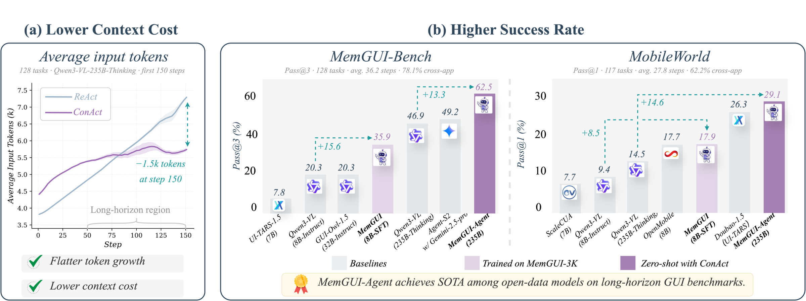
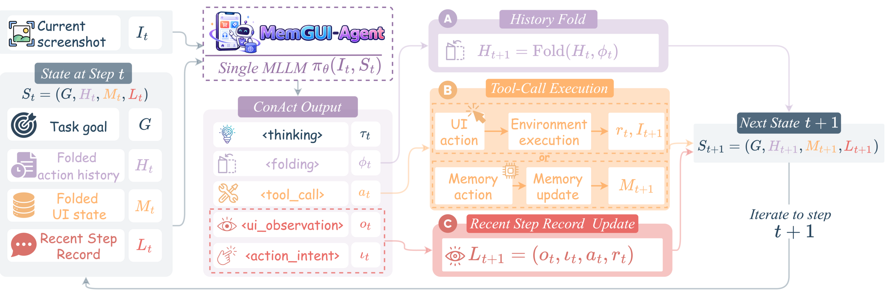
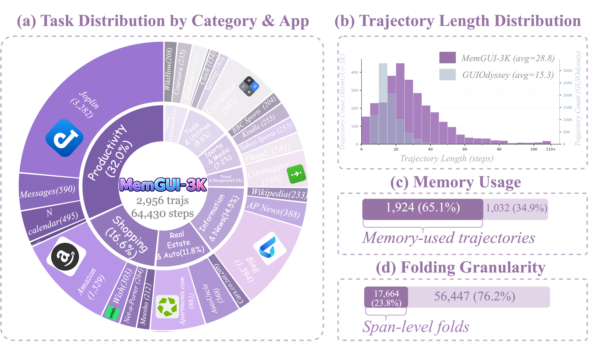

<div align="center">

<h1>
  <br>
  MemGUI-Agent: An End-to-End Long-Horizon Mobile GUI Agent with Proactive Context Management
</h1>


[](https://www.python.org/)
[](https://opensource.org/licenses/Apache-2.0)
[](https://github.com/kwai/MemGUI-Agent/stargazers)
[](https://arxiv.org/abs/2606.19926)
[](https://huggingface.co/datasets/lgy0404/MemGUI-3K)
[](https://huggingface.co/lgy0404/MemGUI-8B-SFT)
[](https://memgui-agent.github.io/)
[](https://lgy0404.github.io/MemGUI-Bench/)
[](https://tongyi-mai.github.io/MobileWorld/)

<b>Official implementation, training, and evaluation code for MemGUI-Agent.</b>

<br>

<video src="https://github.com/user-attachments/assets/3936ae69-d613-4c89-9e21-5ac81ee6b55b" controls muted width="840"></video>

<br>

<a href="https://youtu.be/qvEYNI-myFw"><b>▶ Watch the full demo on YouTube</b></a>

</div>

## 🔥 News

- **2026-06-23**: Open-sourced the
  [code repository](https://github.com/kwai/MemGUI-Agent).
- **2026-06-19**: Paper preprint is available on
  [arXiv](https://arxiv.org/abs/2606.19926).
- **2026-06-16**: Released the
  [project page](https://memgui-agent.github.io/),
  [MemGUI-3K dataset](https://huggingface.co/datasets/lgy0404/MemGUI-3K),
  [MemGUI-8B-SFT model](https://huggingface.co/lgy0404/MemGUI-8B-SFT), and
  [benchmark results](https://lgy0404.github.io/MemGUI-Bench/).

## Main Results

<p align="center">
  
</p>

MemGUI-Agent improves both zero-shot 235B and trained 8B settings on
long-horizon mobile GUI benchmarks. On MemGUI-Bench, MemGUI-Agent-235B reaches
62.5% Pass@3, and MemGUI-8B-SFT reaches 23.4% Pass@1. On the
out-of-distribution MobileWorld GUI-Only benchmark, MemGUI-Agent-235B reaches
29.1% success rate, and MemGUI-8B-SFT reaches 17.9%.

Full benchmark trajectories are available on the official pages:
[MemGUI-Bench](https://lgy0404.github.io/MemGUI-Bench/) and
[MobileWorld](https://tongyi-mai.github.io/MobileWorld/).

For captioned leaderboard tables and paper figures, see the
[project page](https://memgui-agent.github.io/#results).

## Overview

MemGUI-Agent is an end-to-end mobile GUI agent for long-horizon tasks that
require remembering progress, preserving UI facts, and controlling prompt
growth. Its core interface, **ConAct** (**Context-as-Action**), makes context
management part of each model response instead of an external module.

ConAct maintains three structured fields: **Folded Action History**, **Folded UI
State**, and **Recent Step Record**.

<p align="center">
  
</p>

MemGUI-Agent updates folded history, UI memory, and recent step records while
producing the next GUI action. We evaluate both a zero-shot 235B ConAct agent
with unchanged backbone weights and **MemGUI-8B-SFT**, an 8B agent trained on
**MemGUI-3K**.

## MemGUI-3K

MemGUI-3K contains 2,956 successful mobile GUI trajectories, 82,103 task steps,
and 64,430 evaluator-approved reasonable steps.

<p align="center">
  
</p>

Dataset usage: [data/memgui3k/README.md](data/memgui3k/README.md).

## Repository Layout

```text
MemGUI-Agent/
|-- data/
|   `-- memgui3k/                  # Dataset download, restore, packaging, and conversion tools
|-- evaluation/
|   `-- memgui3k_offline_eval/     # Step-level offline evaluation on MemGUI-3K
|-- scripts/                       # Convenience entrypoints
|-- training/
|   `-- ms_swift/                  # MemGUI-8B-SFT ms-swift LoRA SFT template
|-- website/                       # Project-page notes
|-- requirements.txt
`-- README.md
```

## Quick Start

Install the Python dependencies used by the public utilities:

```bash
pip install -r requirements.txt
```

Download MemGUI-3K from Hugging Face:

```bash
bash scripts/download_memgui3k.sh
```

Restore screenshots into `data/MemGUI-3K/images/`:

```bash
bash scripts/restore_memgui3k_images.sh
```

Build step-level multimodal training JSONL files:

```bash
bash scripts/build_memgui3k_training_data.sh
```

This writes:

```text
data/MemGUI-3K/training_data/
|-- train_sft.jsonl
`-- test_sft.jsonl
```

## Training MemGUI-8B-SFT

MemGUI-8B-SFT is trained with [ms-swift](https://github.com/modelscope/ms-swift)
from Qwen3-VL-8B-Instruct. The released template keeps the paper's key
hyperparameters:

| Parameter | Value |
|---|---|
| Base model | `Qwen/Qwen3-VL-8B-Instruct` |
| Training type | LoRA SFT |
| Epochs | 1 |
| Learning rate | `1e-4` |
| LoRA rank / alpha | `8 / 32` |
| Target modules | `all-linear` |
| Max length | `32768` |
| Per-device train batch size | `2` |
| Gradient accumulation | `8` |
| GPUs | 8 |

Run the public template:

```bash
bash training/ms_swift/train_memgui_8b_sft.sh
```

See [training/ms_swift/README.md](training/ms_swift/README.md) for the full
command and environment variables.

## Evaluation

The offline evaluation toolkit compares model outputs with MemGUI-3K gold step
responses and reports action matching, memory actions, folding quality, and
format compliance. See
[evaluation/memgui3k_offline_eval/README.md](evaluation/memgui3k_offline_eval/README.md).

For end-to-end rollout scripts, trajectories, and evaluation results, see:

- MemGUI-Bench: https://github.com/lgy0404/MemGUI-Bench
- MobileWorld: https://github.com/Tongyi-MAI/MobileWorld

## Contact

For questions about the paper, code, or released artifacts, contact
[guangyiliu@zju.edu.cn](mailto:guangyiliu@zju.edu.cn) or the corresponding
author at [yongliu@iipc.zju.edu.cn](mailto:yongliu@iipc.zju.edu.cn).

## ⭐ Star History

<a href="https://www.star-history.com/#kwai/MemGUI-Agent&Date">
  <picture>
    <source media="(prefers-color-scheme: dark)" srcset="https://api.star-history.com/svg?repos=kwai/MemGUI-Agent&type=Date&theme=dark">
    <source media="(prefers-color-scheme: light)" srcset="https://api.star-history.com/svg?repos=kwai/MemGUI-Agent&type=Date">
    
  </picture>
</a>

## Citation

```bibtex
@article{liu2026memgui,
  title={MemGUI-Agent: An End-to-End Long-Horizon Mobile GUI Agent with Proactive Context Management},
  author={Liu, Guangyi and Wu, Gao and Liu, Congxiao and Zhao, Pengxiang and Liu, Liang and Li, Mading and Zhang, Qi and Wang, Mengyan and Guo, Liang and Liu, Yong},
  journal={arXiv preprint arXiv:2606.19926},
  year={2026}
}
```

## License

Code in this repository is released under the Apache License 2.0.
